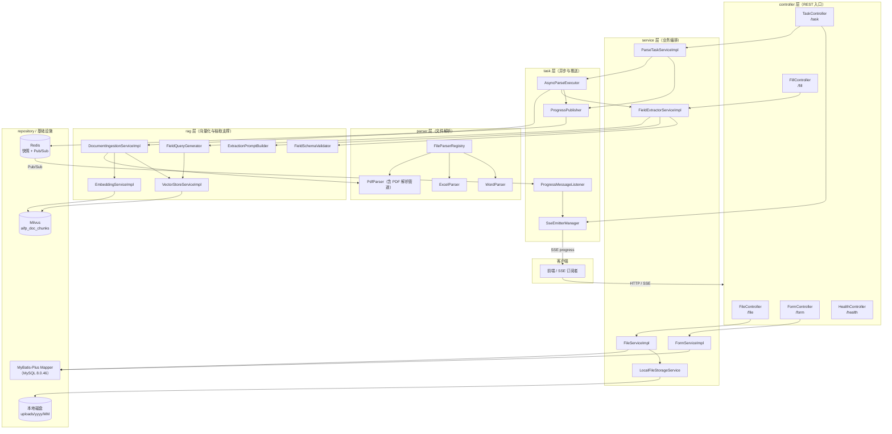
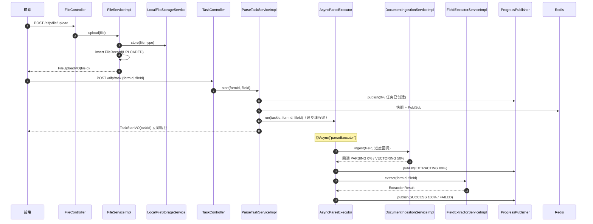
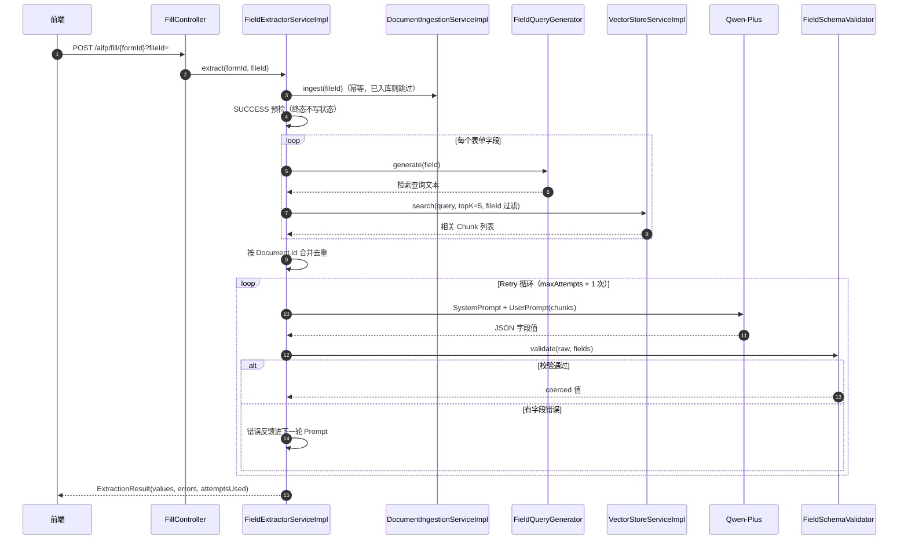
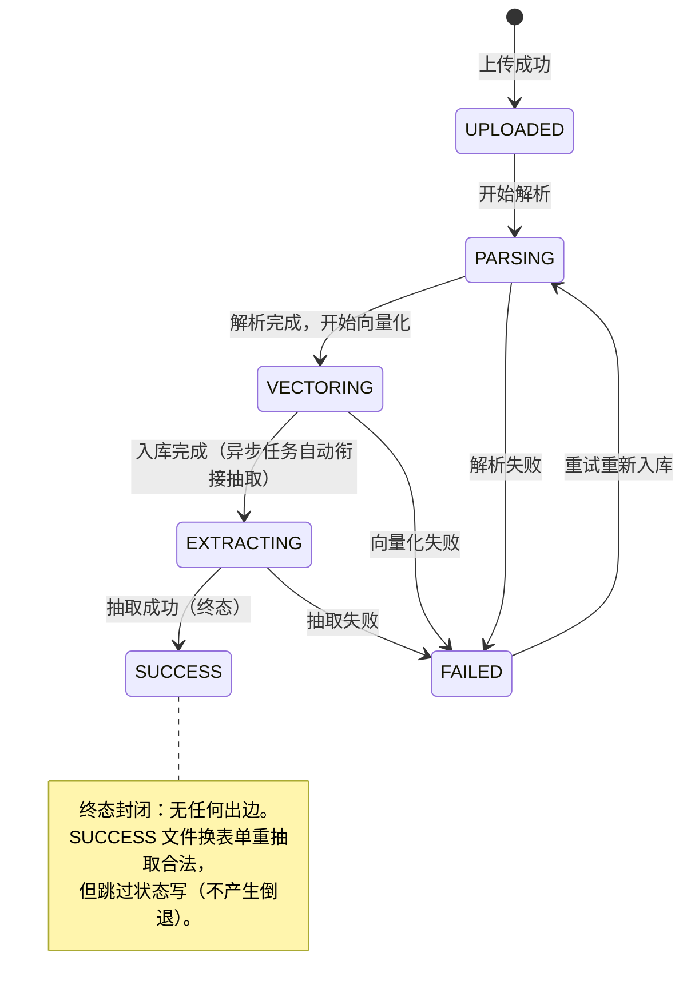

# aiFileParser 后端架构总览

> **适用代码版本**：截至阶段 13 完成后（409 tests / 0 failures）。文中行号基于 2026-09-11 代码快照，后续代码变更可能漂移。
>
> **文档目录**：
> - 本文档 —— 总览（架构 / 包结构 / 链路总图 / 状态机 / 横切设计）
> - [WEB_SERVICE_LAYER.md](./WEB_SERVICE_LAYER.md) —— Web 层 / Service 层 / 异步任务与进度推送
> - [PDF_PARSE_PIPELINE.md](./PDF_PARSE_PIPELINE.md) —— PDF 解析管道（检测 → 解析 → OCR → AST → 清洗 → 渲染 → 分块）
> - [RAG_EXTRACT_PIPELINE.md](./RAG_EXTRACT_PIPELINE.md) —— RAG 向量入库 + AI 字段抽取

---

## 1. 项目概述

**aiFileParser** —— 企业级 AI 文件自动解析自动填报系统。

核心业务闭环：

```
用户上传业务文件(PDF/Excel/Word) → 系统自动解析（文本/表格/OCR）
  → 向量化入库(RAG) → 根据用户自定义表单字段 → AI 模型抽取字段值
  → Schema 校验 + Retry → 自动填充业务表单
```

核心能力：

| 能力      | 说明                                                          |
|---------|-------------------------------------------------------------|
| 动态表单设计  | 运行时创建表单/字段，无需改代码（FieldType 携带 jsonSchemaType 直连 AI Prompt）  |
| 文件解析    | PDF（文本/图像/混合页 + Tesseract OCR）、Excel（POI）、Word（POI）         |
| RAG 知识库 | 文档切分 → Qwen embedding → Milvus 相似检索                         |
| AI 字段抽取 | Spring AI + Qwen-Plus，动态 Prompt + JSON Schema 校验 + Retry 反馈 |
| 异步任务进度  | 线程池异步流水线 + Redis 快照/Pub-Sub + SSE 实时推送                      |
| 状态机保障   | FileStatus 白名单流转，非法迁移抛 2006，终态封闭                            |

---

## 2. 技术栈

| 类别            | 选型                                     | 版本 / 关键参数                              |
|---------------|----------------------------------------|----------------------------------------|
| 后端语言          | Java                                   | 21                                     |
| 框架            | Spring Boot                            | 3.5.13                                 |
| AI 框架         | Spring AI + Spring AI Alibaba          | Spring AI 1.0.0 / Alibaba 1.0.0.2      |
| AI 模型         | Qwen-Plus（DashScope）                   | temperature 0.3                        |
| 文本向量          | DashScope text-embedding-v2            | 1536 维                                 |
| 向量库           | Milvus                                 | IVF_FLAT / COSINE，集合 `aifp_doc_chunks` |
| ORM           | MyBatis-Plus                           | 3.5.16（+ jsqlparser 分页插件）              |
| 数据库           | MySQL                                  | 8.0.46，HikariCP                        |
| 缓存/消息         | Redis（Lettuce）                         | 进度快照 + Pub/Sub                         |
| PDF 解析        | Apache PDFBox                          | 3.0.4                                  |
| Excel/Word 解析 | Apache POI                             | 5.3.0                                  |
| OCR           | Tesseract（进程调用）                        | chi_sim，并发固定 1（2CPU/8GB 资源约束）          |
| Token 计数      | JTokkit cl100k_base                    | 随 spring-ai-bom                        |
| 异步            | Spring @Async + ThreadPoolTaskExecutor | `parseExecutor` 线程池                    |
| 实时推送          | Spring WebMvc SseEmitter               | 超时 30 分钟                               |
| 工具            | Lombok                                 | -                                      |

---

## 3. 分层架构图



---

## 4. 包结构总表

根包 `com.aifp.aiagent`（源码路径 `src/main/java/com/aifp/aiagent/`）。

| 包                      | 职责                                                    | 关键类                                                                                                                            |
|------------------------|-------------------------------------------------------|--------------------------------------------------------------------------------------------------------------------------------|
| `common`               | 统一返回封装与状态码                                            | `Result<T>`（code/message/data/timestamp）、`ResultCode`                                                                          |
| `config`               | 基础设施配置                                                | `AsyncConfig`（parseExecutor 线程池）、`RedisConfig`（JSON 序列化 + Pub/Sub 容器）、`MybatisPlusConfig`、`MybatisMetaObjectHandler`（审计时间自动填充） |
| `controller`           | REST 入口（仅编排，无业务逻辑）                                    | 5 个 Controller，全部返回 `Result<T>`                                                                                                |
| `dto`                  | 请求/响应对象                                               | `TaskProgress`、`ExtractionResult`、`PageQuery`/`PageResult`、各 Form/File VO                                                      |
| `entity`               | 数据库实体（继承 BaseEntity：id/createTime/updateTime/deleted） | `FormDefinition`、`FormFieldDefinition`、`FileRecord`                                                                            |
| `entity.enums`         | 枚举                                                    | `FileType`（扩展名路由）、`FieldType`（jsonSchemaType）、`FileStatus`（状态机）                                                                |
| `exception`            | 异常体系                                                  | `BusinessException`、`GlobalExceptionHandler`（@RestControllerAdvice）                                                            |
| `parser`               | 文件解析门面                                                | `FileParserRegistry`（按 FileType 路由）、`PdfParser`、`ExcelParser`、`WordParser`                                                     |
| `parser.ocr`           | OCR 引擎抽象与实现                                           | `OcrParser` 接口、`TesseractOcrParser`（进程调用 + Semaphore 并发闸门）                                                                     |
| `parser.pdf`           | PDF 解析管道编排                                            | `PdfDocumentParser`、`DefaultPdfAnalyzer`、`PageParserRouter` 等，详见 [PDF_PARSE_PIPELINE.md](./PDF_PARSE_PIPELINE.md)              |
| `parser.pdf.text`      | PDF 原生文本提取 + 坐标系                                      | `DefaultPdfTextExtractor`、`SimpleCoordinateTransformer`（统一 PDF_USER_SPACE）                                                     |
| `parser.pdf.region`    | 视觉区域分析                                                | `DefaultRegionAnalyzer`、`OcrEligibilityEvaluator`、`VisualRegion`                                                               |
| `parser.pdf.layout`    | 表格结构恢复                                                | `HybridTableRecognizer`（@Primary）、Coordinate/Image 两实现                                                                         |
| `parser.pdf.structure` | 标题/KV 识别                                              | `TitleRecognizer`、`KeyValueRecognizer`                                                                                         |
| `parser.pdf.ast`       | 文档抽象语法树（唯一标准结构）                                       | `DocumentAst`、`PageNode`、各节点类型、`DocumentAstAssembler`                                                                          |
| `parser.pdf.clean`     | AST 清洗管道                                              | 6 个 Cleaner，固定顺序执行                                                                                                             |
| `parser.pdf.markdown`  | Markdown 渲染（AST 纯投影）                                  | `MarkdownRenderer`                                                                                                             |
| `parser.pdf.chunk`     | 混合语义分块                                                | `HybridSemanticChunker`、`Chunk`、`TokenCounter`                                                                                 |
| `parser.pdf.page`      | 单页元素解析                                                | `TextPageParser`、`ImagePageParser`、`MixedPageParser`、`PageParserRouter`                                                        |
| `document`             | 通用解析文档模型（非 PDF 链路）                                    | `ParserDocument`、`ParserDocumentMetadata`                                                                                      |
| `rag`                  | 向量化与抽取支撑                                              | 入库/Embedding/向量库/查询生成/Prompt 构建/Schema 校验                                                                                      |
| `repository`           | 数据访问层（MyBatis-Plus Mapper）                            | `FormDefinitionMapper`、`FormFieldDefinitionMapper`、`FileRecordMapper`                                                          |
| `service`              | 业务服务接口与实现                                             | `FileService`、`FormService`、`ParseTaskService`、`FieldExtractorService`                                                         |
| `service.storage`      | 文件存储抽象                                                | `LocalFileStorageService`（`{upload-dir}/yyyy/MM/{uuid}.{ext}`）                                                                 |
| `task`                 | 异步任务与进度推送                                             | `AsyncParseExecutor`、`ProgressPublisher`、`ProgressMessageListener`、`SseEmitterManager`                                         |

---

## 5. 端到端链路总图

### 5.1 上传 + 异步解析任务链



### 5.2 AI 填报抽取链



---

## 6. FileStatus 状态机

定义于 [FileStatus.java](../../java/com/aifp/aiagent/entity/enums/FileStatus.java)
，合法迁移白名单静态初始化后不可变；`FileServiceImpl#updateStatus` 是**状态唯一写入口**
（同态写幂等跳过，非法迁移抛 `2006 FILE_STATUS_ILLEGAL_TRANSITION`）。



关键约束：

| 约束                                                  | 实现位置                                                          |
|-----------------------------------------------------|---------------------------------------------------------------|
| 白名单流转 + 非法迁移抛 2006                                  | `FileStatus#canTransitionTo` + `FileServiceImpl#updateStatus` |
| 同态写（from == to）幂等 no-op                             | `FileServiceImpl#updateStatus`                                |
| Ingest 幂等守卫 `{SUCCESS, VECTORING, EXTRACTING}` 直接跳过 | `DocumentIngestionServiceImpl#ingest`                         |
| Ingest 流程止于 VECTORING，不写 SUCCESS                    | `DocumentIngestionServiceImpl#doIngest`                       |
| SUCCESS 文件重抽取零状态写                                   | `FieldExtractorServiceImpl#extract`（alreadySuccess 预检）        |
| 抽取失败统一落 FAILED（两条触发路径覆盖）                            | `FieldExtractorServiceImpl#markFailed`                        |

---

## 7. 横切设计

### 7.1 统一返回 Result<T>

`common/Result.java`：`code` / `message` / `data` / `timestamp` 四字段。所有 Controller 返回 `Result.success(...)` /
由异常处理器返回 `Result.fail(...)`。SSE 端点例外（返回 `SseEmitter`）。

### 7.2 全局异常处理

`exception/GlobalExceptionHandler.java`（@RestControllerAdvice）转换规则：

| 异常                                                                                   | 转换结果                                  |
|--------------------------------------------------------------------------------------|---------------------------------------|
| `BusinessException`                                                                  | 原样返回业务错误码（如 2001/2006/3001/4001/5001） |
| `MethodArgumentNotValidException` / `BindException` / `ConstraintViolationException` | 40001，聚合字段错误信息                        |
| `MissingServletRequestParameterException` / `MethodArgumentTypeMismatchException`    | 400                                   |
| `HttpMessageNotReadableException`                                                    | HTTP 400 + 400                        |
| 兜底 `Exception`                                                                       | 500，记录完整堆栈，对外返回"系统繁忙"                 |

`ResultCode` 编码分段：2xxx 文件解析（2006 = 非法状态流转）、3xxx AI 调用、4xxx 向量检索、5xxx 动态表单。

### 7.3 ID 序列化约束

`formId` / `fieldId` / `fileId` 等 Long 型 ID 在 JSON 响应中一律序列化为**字符串**，避免 JavaScript Number 精度丢失（雪花
ID 超出 2^53 安全整数范围）。

### 7.4 Redis 序列化约定

`config/RedisConfig.java`：

- 值序列化器：自定义 ObjectMapper —— 注册 `JavaTimeModule`、禁用 `WRITE_DATES_AS_TIMESTAMPS`（日期序列化为 ISO
  字符串）、`activateDefaultTyping(NON_FINAL)` + `BasicPolymorphicTypeValidator`
  白名单（`com.aifp.aiagent.` / `java.` / `org.springframework.`）
- 进度快照带 TTL（默认 3 小时），任务终态由发布方覆盖写入

### 7.5 数据访问层约定

- 实体继承 `BaseEntity`（id/createTime/updateTime/deleted），`MybatisMetaObjectHandler` 自动填充审计时间
- 主键策略：雪花 `assign_id`；逻辑删除字段 `deleted`；表名下划线映射
- 分页：`PageQuery`（默认 pageNum=1、pageSize=10、上限 100）+ `PageResult`

### 7.6 多实现装配约定

| 抽象                         | 实现                                                                | 生产默认                                    |
|----------------------------|-------------------------------------------------------------------|-----------------------------------------|
| `TableStructureRecognizer` | Coordinate / Image / Hybrid 三个 @Component                         | `HybridTableRecognizer` @Primary（组合编排器） |
| `OcrParser`                | `TesseractOcrParser` @ConditionalOnProperty(ocr.engine=tesseract) | 条件装配，PaddleOCR 预留扩展点                    |
| `FileParser`               | PdfParser / ExcelParser / WordParser                              | `FileParserRegistry` 按 FileType 路由      |

### 7.7 配置参数索引

所有可调参数集中在 `application.yml`（支持环境变量覆盖），按模块分区：

| 配置段                                                           | 用途                  | 详见                                                   |
|---------------------------------------------------------------|---------------------|------------------------------------------------------|
| `spring.ai.*` / `spring.datasource.*` / `spring.data.redis.*` | 模型 / 数据源 / Redis 连接 | 本文档第 2 节                                             |
| `rag.chunk.*` / `rag.retrieve.topK` / `rag.extract.retry.*`   | 通用切分 / 检索条数 / 重试次数  | [RAG_EXTRACT_PIPELINE.md](./RAG_EXTRACT_PIPELINE.md) |
| `task.sse.*` / `task.progress.*`                              | SSE 超时 / 进度快照 TTL   | [WEB_SERVICE_LAYER.md](./WEB_SERVICE_LAYER.md)       |
| `document.parser.pdf.detector                                 | text                | ocr                                                  |region|table|structure|clean|markdown|chunk.*` | PDF 管道各层参数 | [PDF_PARSE_PIPELINE.md](./PDF_PARSE_PIPELINE.md) |
| `file.upload-dir`                                             | 上传文件根目录             | [WEB_SERVICE_LAYER.md](./WEB_SERVICE_LAYER.md)       |
