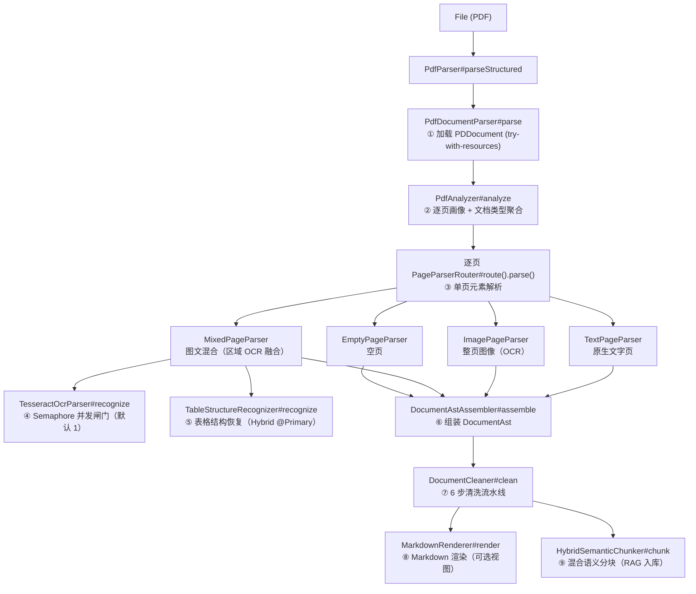
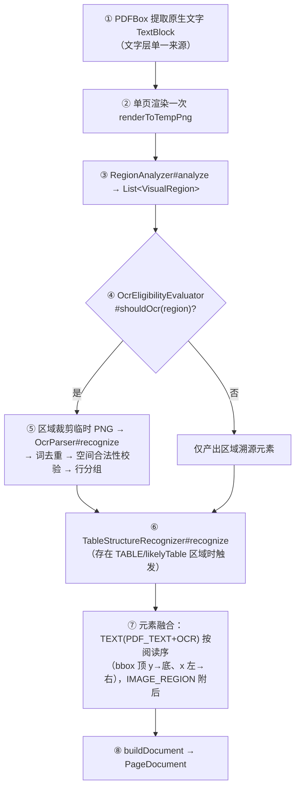
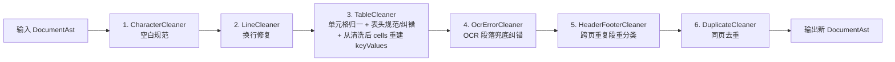

# PDF 解析管道

> **适用代码版本**：截至阶段 13 完成后（409 tests / 0 failures）。行号基于 2026-09-11 代码快照，后续变更可能漂移。
>
> **文档目录**：[ARCHITECTURE.md](./ARCHITECTURE.md)（总览）｜ [WEB_SERVICE_LAYER.md](./WEB_SERVICE_LAYER.md) ｜
> 本文档 ｜ [RAG_EXTRACT_PIPELINE.md](./RAG_EXTRACT_PIPELINE.md)

---

## 1. 管道总图

PDF 解析经历 9 个阶段，产物为清洗后的 `DocumentAst`（文档抽象语法树），它是 Markdown 渲染与语义分块的**唯一标准结构来源**。

两条解析契约（[PdfParser.java](../../java/com/aifp/aiagent/parser/PdfParser.java) 双实现）：

| 契约            | 方法                                | 产物                                      | 消费方                                |
|---------------|-----------------------------------|-----------------------------------------|------------------------------------|
| 旧全文契约         | `PdfParser#parse(File)`           | `ParserDocument`（逐页 PDFText 拼接 `\n` 全文） | 非 PDF 链路保留的 `DocumentChunker` 滑窗切片 |
| **结构契约（主链路）** | `PdfParser#parseStructured(File)` | 清洗后 `DocumentAst`                       | `HybridSemanticChunker` 混合语义切片     |

`parseStructured` = `documentParser.parse(file)`（阶段 2~9 全链路）→ `documentCleaner.clean(ast)`（阶段 10）。

---

## 2. 文档与页面检测层

| 类                                                                                      | 方法                                          | 逻辑要点                                                                                                                    |
|----------------------------------------------------------------------------------------|---------------------------------------------|-------------------------------------------------------------------------------------------------------------------------|
| [DefaultPdfAnalyzer](../../java/com/aifp/aiagent/parser/pdf/DefaultPdfAnalyzer.java)   | `#analyze(PDDocument): PdfInspectionResult` | 逐页委托 `PageAnalyzer#analyze` 得到 `PageProfile`（ contentType/页宽高/图像占比等），再聚合文档级 `PdfContentType`：全部同型取该型，混合页面存在则聚合为 `MIXED` |
| [DefaultPageAnalyzer](../../java/com/aifp/aiagent/parser/pdf/DefaultPageAnalyzer.java) | `#analyze(PDDocument, int): PageProfile`    | 遍历页面资源 XObject 统计有效图像占比 + PDFTextStripper 统计有效文字量，按阈值判定页面类型                                                             |

页面类型判定参数（`document.parser.pdf.detector.*`）：

| 参数                  | 默认   | 含义                                      |
|---------------------|------|-----------------------------------------|
| `full-image-ratio`  | 0.85 | 单图有效占位比 ≥ 该值 → `IMAGE_ONLY`（整页图）        |
| `large-image-ratio` | 0.20 | 有文字 + 大图占比 ≥ 该值 → `MIXED`（Logo/印章小图不影响） |
| `text-min-count`    | 5    | 非空白字符数低于该值视为无有效文字层                      |

页面类型枚举 `PageContentType`：`TEXT_ONLY` / `IMAGE_ONLY` / `MIXED` / `EMPTY`。

---

## 3. 页面解析层（page 包）

**PageParserRouter**（[PageParserRouter.java](../../java/com/aifp/aiagent/parser/pdf/page/PageParserRouter.java)
）：注册表模式，Spring 注入全部 `PageParser`，按 `supportedType()` 建 EnumMap，`#route(PageContext)` O(1) 查表；新增解析器 =
新增 @Component，路由零改动。未注册类型抛 2001。

各解析器统一产出 `PageDocument`（pageNumber/contentType/页宽高/`List<PageElement>`/`List<TableGrid>`/parserName）：

| 解析器                     | 逻辑要点                                                                                                                            |
|-------------------------|---------------------------------------------------------------------------------------------------------------------------------|
| `TextPageParser#parse`  | 原生文字页：PDFBox 文字块直接映射 TEXT 元素（source=PDF_TEXT），无 OCR                                                                             |
| `ImagePageParser#parse` | 整页图页：渲染整页 → `OcrParser#recognize` 整页识别（IMAGE_ONLY 页豁免"禁整页 OCR"约束）→ 词 → 行 TEXT 元素（source=OCR，confidence=行内词均值）；OCR FAILED 抛 2005 |
| `EmptyPageParser#parse` | 空页：返回零元素 PageDocument                                                                                                           |
| `MixedPageParser#parse` | **核心融合页**，见 3.1                                                                                                                 |

### 3.1 MixedPageParser 工作流（[MixedPageParser.java](../../java/com/aifp/aiagent/parser/pdf/page/MixedPageParser.java#L76-L111)）

关键原则（类 javadoc 冻结）：

- **PDF 原生文字恒由 PDFBox 提供**，OCR 只做补充，两者不互相覆盖
- **禁止变相整页 OCR**：MIXED 页 OCR 输入恒为视觉区域裁剪图；整页图区域经 `OcrEligibilityEvaluator` 豁免（占页面积比 ≥ 0.85
  恒不区域 OCR）
- **STAMP / SIGNATURE / 普通 IMAGE 默认不 OCR**，仅 TABLE/表格候选及存在明显视觉文本候选（textCandidateScore ≥ 0.60）的区域允许
- 区域元素（IMAGE_REGION）**恒产出**（溯源 + 阶段 7/8 消费），likelyTable 仅为候选标记
- OCR 词去重**主判定 = 词面积被 PDF 原生文字覆盖比例 ≥ 0.80**（非 IoU）
- 空间合法性：OCR 词 bbox 必须落在源区域内（容差 2pt），不合法剔除并告警，不中断解析
- 失败语义：OCR FAILED → 2005 `FILE_OCR_ERROR`；表格识别异常 → 兜底降级空 tables 不中断；渲染图/裁剪图临时文件 finally 即用即删

### 3.2 PageElement 元素模型

| 字段                                        | 说明                                      |
|-------------------------------------------|-----------------------------------------|
| `type`                                    | `PageElementType`：TEXT / IMAGE_REGION 等 |
| `source`                                  | `ElementSource`：PDF_TEXT / OCR / IMAGE  |
| `text` / `bbox` / `fontSize` / `fontName` | OCR 来源 fontSize=null（永不判标题）             |
| `regionType` / `confidence`               | OCR 行元素携带来源区域类型与词置信度均值（0~100）           |

---

## 4. OCR 引擎层（parser/ocr 包）

**TesseractOcrParser**（[TesseractOcrParser.java](../../java/com/aifp/aiagent/parser/ocr/TesseractOcrParser.java)
），@ConditionalOnProperty(ocr.engine=tesseract)。

| 方法                                  | 逻辑要点                                                                                                                                                                                                                                                                    |
|-------------------------------------|-------------------------------------------------------------------------------------------------------------------------------------------------------------------------------------------------------------------------------------------------------------------------|
| `#recognize(OcrRequest): OcrResult` | **并发闸门**：`Semaphore permits = new Semaphore(1)`（2CPU/8GB 资源硬约束，同步调用天然串行 + 防上层误并发）；`acquire()` 成功后执行 `doRecognize`，finally 中仅对成功 acquire 过的线程 `release()`；`InterruptedException` 恢复中断标志并转 FAILED；任何引擎层异常收敛为 FAILED，不向上泄漏                                                 |
| `#doRecognize`（私有）                  | ① 引擎路径解析（默认走 PATH 裸命令名，`OCR_TESSERACT_PATH` 环境变量覆盖，跨平台）→ ② 启动 Tesseract 进程（chi_sim + psm 3）→ ③ 读 stdout → `process.waitFor(timeout)` 超时控制（默认 300s）→ ④ 解析 TSV → ⑤ 构造 `OcrResult`（status: SUCCESS/EMPTY/FAILED + `OcrPage` + `OcrWord`（text/bbox 像素坐标/confidence/lineNo）） |

---

## 5. 区域分析层（region 包）

| 类                                                                                                     | 方法                                                                          | 职责                                                                                                                                                                                |
|-------------------------------------------------------------------------------------------------------|-----------------------------------------------------------------------------|-----------------------------------------------------------------------------------------------------------------------------------------------------------------------------------|
| [DefaultRegionAnalyzer](../../java/com/aifp/aiagent/parser/pdf/region/DefaultRegionAnalyzer.java)     | `#analyze(document, pageIndex, textBlocks, image, dpi): List<VisualRegion>` | 基于渲染图像素分析切分视觉区域：判 `RegionType`（TABLE/IMAGE/STAMP/SIGNATURE/UNKNOWN 等）、`likelyTable`+`tableScore`（表格候选标记，供阶段 7）、文字覆盖率 coverageRatio、视觉文本候选分 textCandidateScore、占页面积比 pageAreaRatio |
| [OcrEligibilityEvaluator](../../java/com/aifp/aiagent/parser/pdf/region/OcrEligibilityEvaluator.java) | `#shouldOcr(VisualRegion): boolean`                                         | 区域 OCR 准入判定：跳过低 coverage 的 UNKNOWN（缺文字候选）、排除 STAMP/SIGNATURE/普通 IMAGE、放行 TABLE/TABLE_CANDIDATE；整页图豁免（pageAreaRatio ≥ 0.85 恒不放行区域 OCR）                                             |
| `CoordinateMatcher`                                                                                   | `#pixelCropBounds` / `#toPdfBox` / `#isDuplicateWord` / `#isWithinRegion`   | 裁剪像素框计算、像素 → PDF_USER_SPACE 坐标变换（MediaBox + origin(0,0) + rotation=0 几何参考，全管道统一）、词去重主判定（覆盖比 ≥ 0.80）、空间合法性（bbox 外扩 2pt 容差）                                                         |

`VisualRegion` 关键字段：`regionType`、`bbox`（PDF 用户空间）、`likelyTable`（boolean）、`tableScore`
（double）、`coverageRatio`、`textCandidateScore`、`pageAreaRatio`、`description`。

---

## 6. 表格结构恢复层（layout 包）

三实现按"方式"分工，`HybridTableRecognizer` 为 @Primary 生产默认（组合编排器）：

| 实现                                | 输入依据            | 适用场景                                         |
|-----------------------------------|-----------------|----------------------------------------------|
| `CoordinateTableRecognizer`       | 原生文字块坐标 + 横竖线行程 | 文字层完整的规则表格                                   |
| `ImageTableRecognizer`            | 渲染图灰度二值 + 格网交点  | 纯图像表格（灰度阈值 dark-threshold=200 兼容浅灰线）         |
| `HybridTableRecognizer`（@Primary） | 上述两者融合 + 表头 OCR | 生产默认：先坐标格网，图像格网补充，共享 `TableRecognitionInput` |

统一入口签名：`#recognize(TableRecognitionInput): List<TableGrid>`（pageNumber/渲染图/dpi/页宽高/textBlocks/regions）。

要点：

- `TableGrid` = 行列表格骨架：`List<TableRow>` → `TableCell`（bbox/rowSpan/colSpan/header/value）
- 格网有效性双守卫：交点存在率 ≥ 0.20（grid-intersection-density-min）+ 原生文字行包住率 ≥ 0.60
- 值归属：文字段被单元格覆盖 ≥ 0.60 为主判定，中心点辅助兜底 ≥ 0.50（跨格合并行由段级切分 + 块级守卫拦截）
- **表头 OCR**（header-ocr-enabled，默认 true）：仅对"缺原生文字层"的候选格触发（native-text-coverage 0.60 主判定）；置信度 <
  0.60 降级 header=null；表头 OCR 裁剪图 round-trip 校验失败同样优雅降级
- 表格识别全程异常封闭：引擎内部异常不外泄，`MixedPageParser` 再兜底降级空 tables

---

## 7. AST 组装层（ast 包）

**DocumentAstAssembler
**（[DocumentAstAssembler.java](../../java/com/aifp/aiagent/parser/pdf/ast/DocumentAstAssembler.java)）：`#assemble(fileName, inspection, pageDocuments)` ——
documentId 为 parse 期 UUID；metadata 记 totalPages/documentType；页序 = PDF 页序，逐页委托 `PageNodeAssembler`。

**PageNodeAssembler**（[PageNodeAssembler.java](../../java/com/aifp/aiagent/parser/pdf/ast/PageNodeAssembler.java)
）：PageDocument → PageNode 的节点分派与组装：

- TEXT(PDF_TEXT) 元素 → 经 `TitleRecognizer#isTitle`（主字号 ≥ 页内 PDF_TEXT 中位字号 × 1.2 且 ≤ 50 字符；OCR
  无字号永不判题）分派为 `TitleNode` / `ParagraphNode`（confidence 归一：PDF_TEXT 恒 1.0，OCR /100）
- TEXT(OCR) 元素 → `ParagraphNode`（source=OCR）
- IMAGE_REGION 元素 → 占位 `DocumentNode`（description 承载诊断信息）
- `TableGrid` → `TableNodeAssembler` 组装 `TableNode`
  （rows/cells/header/source=FUSION）；`KeyValueRecognizer#extract(grid)` 仅对 **FUSION**
  表识别键值对 → `PageNode.keyValues`

**节点类型与双视图契约**：

| 节点类型                                           | 说明                                                  |
|------------------------------------------------|-----------------------------------------------------|
| `ParagraphNode` / `TitleNode`                  | 正文段 / 标题（fontSize/fontName/Confidence 语义见类 javadoc） |
| `TableNode` / `TableRowNode` / `TableCellNode` | 表格（cell 携带 header/value，row-starting cell 语义）       |
| `KeyValueNode`                                 | 键值对（identity equals；仅存于 keyValues）                  |
| `DocumentNode`（type=HEADER/FOOTER 等）           | 通用节点（清洗阶段重分类产物）                                     |

| 视图   | 字段                                                   | 消费方              |
|------|------------------------------------------------------|------------------|
| 渲染视图 | `PageNode.nodes`（阅读序：bbox 顶 y 降序 → x 升序，非 bbox 元素殿后） | MarkdownRenderer |
| 语义视图 | `PageNode.keyValues`                                 | Chunker / KV 消费  |

**硬约束**：`KeyValueNode` 不进 `nodes`（渲染不重复）；下游（clean/markdown/chunk）只依赖 `ast` 包，且 rebuild 时必须经 builder
新建实例、透传原 bbox 引用（PDF_USER_SPACE 零坐标变换），绝不修改输入 AST。

---

## 8. 清洗层（clean 包，阶段 10）

**DocumentCleaner**（[DocumentCleaner.java](../../java/com/aifp/aiagent/parser/pdf/clean/DocumentCleaner.java#L52-L61)）编排
6 步流水线，输入输出均为 DocumentAst，输出为全新 AST（输入零改动）：

| # | Cleaner               | 核心方法                                           | 职责与关键规则                                                                                                                                                            |
|---|-----------------------|------------------------------------------------|--------------------------------------------------------------------------------------------------------------------------------------------------------------------|
| 1 | `CharacterCleaner`    | `#clean(String)`                               | 段落/标题/单元格 header+value 全文本字段安全空白规范                                                                                                                                 |
| 2 | `LineCleaner`         | `#joinParagraph(String)`                       | 段落/标题段模式换行修复；数字续行规则：两边界字符均为数字类（digit/O/o，非 l）→ 无空格拼接（`17O\n649.08` 预处理后接全）                                                                                         |
| 3 | `TableCleaner`        | `#cleanTable(TableNode)` / `#rebuildKeyValues` | 单元格值 Cell 模式归一 + 表头规范化 + OCR 数字纠错（仅 header，降级保护）；**立即从清洗后 cells 重建 keyValues**（D4 单一事实源，杜绝 KV 与表格漂移）                                                               |
| 4 | `OcrErrorCleaner`     | `#fix(String)`                                 | **仅 source=OCR 段落**：先接全断行数字再纠错；`O` 在数字间纠正（1O2A→102A），`l` 需两侧均为数字；只折叠空白，不增删非空白字符（PDF_TEXT/FUSION 永不触碰）                                                              |
| 5 | `HeaderFooterCleaner` | `#reclassify(List<PageNode>)`                  | 跨页重复段（≥ min-pages=2 页出现）按带位重分类：顶部带 top = pageHeight−(y+height) ÷ 页高 ≤ 0.12、底部带 y ÷ 页高 ≤ 0.12（PDF 用户空间）；双带模糊跳过；重分类节点保留在 nodes（type=HEADER/FOOTER base DocumentNode） |
| 6 | `DuplicateCleaner`    | `#dedupPage(nodes)` / `#dedupKeyValues`        | 保守同页去重：段落按 normalize key 保首个、空白段删除、KV按(key,value)完全重复去重；同 key 不同值合法保留                                                                                              |

---

## 9. Markdown 渲染层（markdown 包）

**MarkdownRenderer
**（[MarkdownRenderer.java](../../java/com/aifp/aiagent/parser/pdf/markdown/MarkdownRenderer.java)）：`#render(DocumentAst): String` ——
DocumentAst **纯投影**（只允许 import ast 包 + JDK/Spring，源文件 import 受单元测试守护），不做任何文本模式结构推断。

渲染规则：

| 输入                              | 输出                                                                                         |
|---------------------------------|--------------------------------------------------------------------------------------------|
| 文档开头                            | `# {fileName}`                                                                             |
| 页与页之间                           | `---` 分隔                                                                                   |
| TITLE 节点                        | `## {text}`（换行→空格）                                                                         |
| PARAGRAPH                       | 原文 + 空行分隔                                                                                  |
| TableNode                       | GFM 表格：首行表头 + `\| --- \|` 分隔行；rowSpan/colSpan 展开；`\|`→`\|`、换行→` `；空表格跳过                 |
| HEADER / FOOTER 节点              | 跳过不渲染                                                                                      |
| IMAGE/STAMP/SIGNATURE 占位节点      | description 独立成行                                                                           |
| KV（key-values-enabled=true，默认开） | 页 nodes 后追加 `字段：值` 清单，整块以 `<!-- key-values -->` / `<!-- /key-values -->` 注释包裹（渲染策略，不改 AST） |

---

## 10. 混合语义分块层（chunk 包，阶段 12）

**HybridSemanticChunker
**（[HybridSemanticChunker.java](../../java/com/aifp/aiagent/parser/pdf/chunk/HybridSemanticChunker.java)）：`#chunk(DocumentAst, Long fileId): List<Chunk>` ——
只消费清洗后 DocumentAst；编排 `StructuralChunker#chunk(ast)`（结构边界 + 原子块，超长时委托 `SemanticChunker`
Sentence→Token 窗口降级）→ 全文档统一编号 chunkIndex/totalChunks → 补 fileId（**Long→String**）/fileName 构建 `Chunk`。

切块优先级链：**标题 > 章节 > 段落 > Table > KeyValue > List（预留）> Sentence > Token Length**。

| 规则          | 说明                                                                                                                                              |
|-------------|-------------------------------------------------------------------------------------------------------------------------------------------------|
| 表格整块        | 一个 TableNode 恒为一个 Chunk（即使超 chunkSize=800 token；超大表格由 `SemanticChunker#splitTable` 行降级）；`TableTextRenderer#render` 产出 Markdown 表（与渲染层同一形态）保列值关系 |
| 段落按 token 切 | `SemanticChunker#splitParagraph`：超预算段落按句子聚合，兜底 Token 窗口（overlap=200 仅降级层生效）；TokenCounter（JTokkit cl100k_base）计数                                 |
| 图片并入相邻段     | IMAGE/STAMP/SIGNATURE 占位不独立成块，并入相邻段落 Chunk                                                                                                      |
| KV 与表格互斥    | 整页含表格时该页 KV 不产 Chunk（D1 table-first 排除，防语义重复）；`SemanticChunker#splitKeyValues` 处理无表格页 KV 分组                                                     |
| titlePath   | 标题层级路径（`t1 > t2`），null 归一空串（无标题文档契约）                                                                                                            |

`Chunk` 关键字段：content / fileId(String) / fileName / pageStart / pageEnd / titlePath / `ChunkType`
（PARAGRAPH/TABLE/KEY_VALUES）/ chunkIndex / totalChunks / bbox / confidence / sourceType。

参数：`document.parser.pdf.chunk.size`（默认 800）/ `overlap`（默认 200），与旧滑窗口径（rag.chunk.*）相互独立。

---

## 11. Excel / Word 解析与文件级路由

**FileParserRegistry**（[FileParserRegistry.java](../../java/com/aifp/aiagent/parser/FileParserRegistry.java)）：Spring
注入全部 `FileParser`，按 `supportedType()` 建 Map；`#get(FileType)` O(1) 路由，未注册抛 2002。与 PageParserRouter
同构（注册表 + 开闭原则）。

| Parser                                                             | supportedType | 逻辑要点                                                    |
|--------------------------------------------------------------------|---------------|---------------------------------------------------------|
| [ExcelParser](../../java/com/aifp/aiagent/parser/ExcelParser.java) | EXCEL         | POI 遍历 Sheet/Row/Cell 拼接文本为 `ParserDocument`（保留行/表结构信息） |
| [WordParser](../../java/com/aifp/aiagent/parser/WordParser.java)   | WORD          | POI XWPF 遍历段落/表格拼接为 `ParserDocument`                    |
| `PdfParser`                                                        | PDF           | 双契约见第 1 节                                               |

Excel/Word 走旧契约：`ParserDocument` → `DocumentChunker` 滑窗切片 →
向量入库（见 [RAG_EXTRACT_PIPELINE.md](./RAG_EXTRACT_PIPELINE.md)）。

---

## 12. 配置参数索引（document.parser.pdf.*）

完整注释见 [application.yml](../application.yml)，速查表：

| 配置段           | 关键参数（默认值）                                                                                                                                                                                                             | 作用层          |
|---------------|-----------------------------------------------------------------------------------------------------------------------------------------------------------------------------------------------------------------------|--------------|
| `detector.*`  | full-image-ratio(0.85) / large-image-ratio(0.20) / text-min-count(5)                                                                                                                                                  | 页面检测         |
| `text.*`      | line-tolerance-ratio(0.50) / space-gap-ratio(0.25) / segment-gap-ratio(2.0) / block-gap-ratio(1.20)                                                                                                                   | 文字行/段/块聚合    |
| `ocr.*`       | engine(tesseract) / language(chi_sim) / tesseract-path / render-dpi(200) / psm(3) / timeout-seconds(300) / concurrency(1)                                                                                             | OCR 引擎       |
| `region.*`    | text-coverage-skip-ratio(0.50) / image-text-candidate-ratio(0.60) / stamp-red-ratio(0.10) / word-dedup-ratio(0.80) / spatial-tolerance-pt(2.0) / full-page-forbidden-ratio(0.85)                                      | 区域分析与 OCR 准入 |
| `table.*`     | min-h/v-line-ratio(0.15/0.12) / dark-threshold(200) / grid-intersection-density-min(0.20) / value-coverage-ratio(0.60) / header-ocr-enabled(true) / header-min-confidence(0.60) / header-native-text-coverage(0.60) 等 | 表格结构恢复       |
| `structure.*` | title-font-ratio(1.2)                                                                                                                                                                                                 | 标题识别         |
| `clean.*`     | line-join.title-like-max-length(20) / header-footer.min-pages(2)+top/bottom-band(0.12) / ocr-digit-fix.enabled(true)                                                                                                  | 清洗           |
| `markdown.*`  | key-values-enabled(true)                                                                                                                                                                                              | KV 渲染开关      |
| `chunk.*`     | size(800) / overlap(200)                                                                                                                                                                                              | 混合语义分块       |
