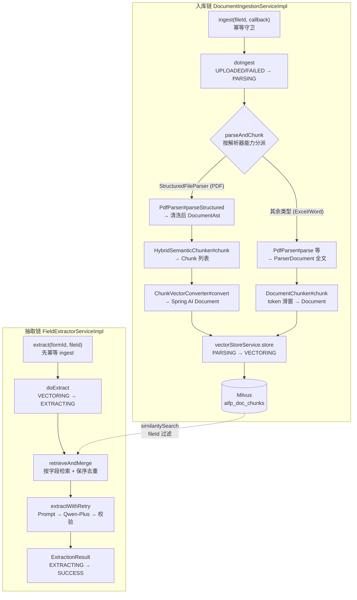
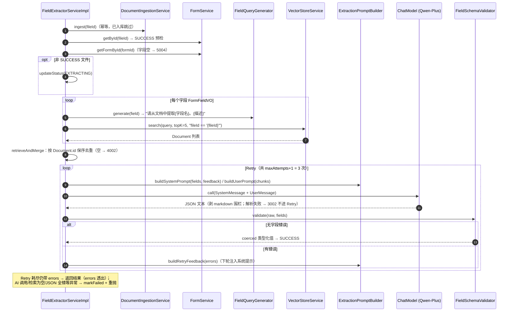

# RAG 向量入库 + AI 字段抽取

> **适用代码版本**：截至阶段 13 完成后（409 tests / 0 failures）。行号基于 2026-09-11 代码快照，后续变更可能漂移。
>
> **文档目录**：[ARCHITECTURE.md](./ARCHITECTURE.md)
> （总览）｜ [WEB_SERVICE_LAYER.md](./WEB_SERVICE_LAYER.md) ｜ [PDF_PARSE_PIPELINE.md](./PDF_PARSE_PIPELINE.md) ｜ 本文档

---

## 1. 管道总图

RAG 层分两条链路：**入库链**（解析产物 → Milvus）与**抽取链**（表单字段 → 检索 → LLM →
校验）。两条链路由 `FieldExtractorService` 串联（extract 首步幂等调用 ingest）。



---

## 2. 入库链（DocumentIngestionServiceImpl）

[DocumentIngestionServiceImpl.java](../../java/com/aifp/aiagent/rag/impl/DocumentIngestionServiceImpl.java)

| 方法                                                | 逻辑要点                                                                                                                                                                                                                                                                  | 下游调用                                                    |
|---------------------------------------------------|-----------------------------------------------------------------------------------------------------------------------------------------------------------------------------------------------------------------------------------------------------------------------|---------------------------------------------------------|
| `#ingest(Long fileId)`                            | 单参重载，callback=null                                                                                                                                                                                                                                                    | `#ingest(fileId, null)`                                 |
| `#ingest(Long fileId, ProgressCallback callback)` | **幂等守卫**：状态 ∈ {SUCCESS, VECTORING, EXTRACTING} 直接跳过（chunk 已入库，避免重复写 Milvus；跳过时不触发回调）→ `doIngest`；任一异常 → `markFailed`（FAILED，吞二次异常）+ 抛业务异常（BusinessException 原样，其他包 2001）                                                                                              | `FileService#getById` / `#updateStatus`                 |
| `#doIngest`（私有）                                   | ① `updateStatus(PARSING)` + 回调"PARSING" → ② `parseAndChunk` → ③ `updateStatus(VECTORING)` + 回调"VECTORING" → ④ `store(chunks)`。**止于 VECTORING 不落 SUCCESS**（严格状态序列：SUCCESS 仅由抽取阶段落库）                                                                                    | `FileService#updateStatus` / `VectorStoreService#store` |
| `#parseAndChunk`（私有）                              | **双分支分派**：`FileParserRegistry#get(fileType)` 取解析器；`instanceof StructuredFileParser`（PDF）→ `parseStructured` → `HybridSemanticChunker#chunk(ast, fileId)` → `ChunkVectorConverter#convert`；否则 → `parse`（ParserDocument 全文，metadata 注入 fileId）→ `DocumentChunker#chunk` | `FileStorageService#load` / 两套 Chunker                  |
| `#markFailed`（私有）                                 | 落 FAILED，异常吞掉不覆盖原始异常                                                                                                                                                                                                                                                  | `FileService#updateStatus`                              |

`ProgressCallback`（[ProgressCallback.java](../../java/com/aifp/aiagent/rag/ProgressCallback.java)
）：函数式接口 `onStageStart(String stageCode)`，由 `AsyncParseExecutor` 注入驱动 0%/50% 进度发布。

### 2.1 两套 Chunker 对比

| 维度      | 结构链（PDF）                                                  | 旧滑窗链（Excel/Word）                  |
|---------|-----------------------------------------------------------|-----------------------------------|
| 输入      | 清洗后 `DocumentAst`                                         | `ParserDocument` 全文               |
| Chunker | `HybridSemanticChunker`（结构边界 + 语义降级）                      | `DocumentChunker`（token 滑动窗口）     |
| 参数      | `document.parser.pdf.chunk.size/overlap`（800/200）         | `rag.chunk.size/overlap`（800/200） |
| 语义保障    | 表格整块保列值关系、标题层级 titlePath、KV/表格互斥                          | 纯文本窗口，无结构语义                       |
| 产物      | `Chunk` → `ChunkVectorConverter` → Document               | 直接产出 Document                     |
| 详细规则    | 见 [PDF_PARSE_PIPELINE.md](./PDF_PARSE_PIPELINE.md) 第 10 节 | -                                 |

### 2.2 ChunkVectorConverter 元数据约定

[ChunkVectorConverter.java](../../java/com/aifp/aiagent/rag/ChunkVectorConverter.java)：`#convert(List<Chunk>)`
将 `Chunk` 映射为 Spring AI `Document`（content + metadata）：

- metadata 键：`fileId`(String) / `fileName` / `pageStart` / `pageEnd` / `titlePath` / `chunkType`(
  code) / `chunkIndex` / `totalChunks` / `sourceType`，可选 `bbox` / `confidence`
- **null 值一律省略键**（Spring AI Document 拒绝 null 值 + Milvus 标量空值规避）
- 数值统一 Integer（便于 Milvus 标量过滤与 Prompt 数值语义）；空内容块跳过不入库

### 2.3 Embedding 与向量存储

**EmbeddingServiceImpl**（[EmbeddingServiceImpl.java](../../java/com/aifp/aiagent/rag/impl/EmbeddingServiceImpl.java)）：

| 方法                                         | 逻辑要点                                                                            |
|--------------------------------------------|---------------------------------------------------------------------------------|
| `#embed(String): float[]`                  | 单文本向量化（Spring AI `EmbeddingModel`，DashScope text-embedding-v2，1536 维）；失败收敛 3001 |
| `#embedBatch(List<String>): List<float[]>` | 批量 `embedForResponse`；失败收敛 3001                                                 |

> 实际入库路径中，embedding 由 `VectorStore#add` 内部自动触发（Spring AI Milvus
> 自动装配，配置 `spring.ai.dashscope.embedding.options.model`）；EmbeddingService 作为独立抽象保留供扩展。

**VectorStoreServiceImpl
**（[VectorStoreServiceImpl.java](../../java/com/aifp/aiagent/rag/impl/VectorStoreServiceImpl.java)）：

| 方法                                       | 逻辑要点                                                                                                                       |
|------------------------------------------|----------------------------------------------------------------------------------------------------------------------------|
| `#store(List<Document>)`                 | **空切片防御**：null/空列表直接跳过（Milvus 空插入行为不确定，链路闭环由抽取阶段"未检索到切片"→ FAILED 兜底）；`vectorStore.add`；失败收敛 4001                           |
| `#search(query, topK)`                   | 无过滤重载                                                                                                                      |
| `#search(query, topK, filterExpression)` | `SearchRequest.builder().query().topK()` + 可选 `filterExpression`（如 `fileId == '123'` 防跨文件污染）→ `similaritySearch`；失败收敛 4002 |

### 2.4 Milvus 存储约定

| 配置项          | 值                                |
|--------------|----------------------------------|
| collection   | `aifp_doc_chunks`                |
| embedding 维度 | 1536（须与 text-embedding-v2 一致）    |
| 索引 / 度量      | IVF_FLAT / COSINE                |
| schema 初始化   | `initialize-schema: true`（自动建集合） |

---

## 3. 抽取链（FieldExtractorServiceImpl）

[FieldExtractorServiceImpl.java](../../java/com/aifp/aiagent/service/impl/FieldExtractorServiceImpl.java)
，被 `FillController`（同步）与 `AsyncParseExecutor`（异步任务）双路径复用。

### 3.1 时序图



### 3.2 方法表

| 方法                                                     | 逻辑要点                                                                                                                                                                                                                              |
|--------------------------------------------------------|-----------------------------------------------------------------------------------------------------------------------------------------------------------------------------------------------------------------------------------|
| `#extract(Long formId, Long fileId): ExtractionResult` | ① `ingest(fileId)` 幂等 → ② **SUCCESS 预检**（终态文件换表单重抽取合法，但 skipStatusWrites=true，零状态写，杜绝 SUCCESS→EXTRACTING 倒退）→ ③ `doExtract` → ④ 异常时 `markFailed`（SUCCESS 文件除外）并原样重抛                                                               |
| `#doExtract`（私有）                                       | ① `loadFields`（表单不存在 5001 / 字段空 5004）→ ② 非 SUCCESS 写 EXTRACTING → ③ `retrieveAndMerge`（filter=`fileId == '{id}'`；空结果抛 4002）→ ④ `extractWithRetry` → ⑤ 非 SUCCESS 写 SUCCESS                                                         |
| `#retrieveAndMerge`（私有）                                | 逐字段 `FieldQueryGenerator#generate` → `VectorStoreService#search(query, topK, filter)` → 按 `Document.id` `LinkedHashMap` 保序去重合并                                                                                                    |
| `#extractWithRetry`（私有）                                | userPrompt 固定（chunks 拼接）；每轮重建 systemPrompt（带累积 feedback）→ `callChatModel` → `parseJson`（剥 ```json 围栏，失败抛 3002 **不进字段级 Retry**）→ `FieldSchemaValidator#validate`；无错误即返回，共 `maxAttempts + 1` 次调用；耗尽后返回带 errors 的结果（attemptsUsed 透出） |
| `#callChatModel`（私有）                                   | `chatModel.call(new Prompt(SystemMessage + UserMessage))` 取文本；失败收敛 3001                                                                                                                                                           |
| `#markFailed`（私有）                                      | 非 SUCCESS 文件落 FAILED；二次异常吞掉                                                                                                                                                                                                       |

### 3.3 FieldQueryGenerator（[FieldQueryGenerator.java](../../java/com/aifp/aiagent/rag/FieldQueryGenerator.java)）

`#generate(FormFieldVO): String` —— 模板 `请从文档中提取%s。`（fieldName 主导），description 非空则追加为检索提示。独立组件便于单测与未来替换检索策略。

### 3.4 ExtractionPromptBuilder（[ExtractionPromptBuilder.java](../../java/com/aifp/aiagent/rag/ExtractionPromptBuilder.java)）

| 方法                                     | 逻辑要点                                                                                                                                          |
|----------------------------------------|-----------------------------------------------------------------------------------------------------------------------------------------------|
| `#buildSystemPrompt(fields, feedback)` | 角色指令（"严格 JSON 返回，无解释文字/markdown 围栏"）+ `#buildSchema` 动态 JSON Schema（key=fieldCode，类型复用 `FieldType#getJsonSchemaType()`，无硬编码映射表）+ 可选 Retry 反馈段 |
| `#buildUserPrompt(chunks)`             | `文档片段：` + 各 Document 文本拼接 + 尾部指令（"缺失字段用 null"）                                                                                                |
| `#buildRetryFeedback(errors)`          | 逐条列出 `字段 {code} 错误类型[{TYPE/MISSING/FORMAT}]: {message}`，注入下轮系统提示                                                                              |

### 3.5 FieldSchemaValidator（[FieldSchemaValidator.java](../../java/com/aifp/aiagent/rag/FieldSchemaValidator.java)）

编程式动态字段校验（运行时字段不适用注式 Bean Validation）。`#validate(raw, fields): ValidationResult`：

| FieldType | 转换规则                                                                             | 失败归类    |
|-----------|----------------------------------------------------------------------------------|---------|
| STRING    | `toString`                                                                       | TYPE    |
| INTEGER   | 支持千分位逗号 + "万/亿"单位换算；`longValueExact`（小数值拒绝）                                      | TYPE    |
| DECIMAL   | 同上单位解析 + `stripTrailingZeros`                                                    | TYPE    |
| DATE      | 按 4 种格式依序尝试：`yyyy-MM-dd` / `yyyy/MM/dd` / `yyyy年MM月dd日` / `yyyyMMdd` → LocalDate | FORMAT  |
| BOOLEAN   | 布尔值解析                                                                            | TYPE    |
| 缺失值       | required=true → MISSING 错误；否则 coerced 置 null（合法缺失）                               | MISSING |

`ValidationResult` = 类型化 `coerced`（LinkedHashMap，缺字段置
null）+ `errors`（`FieldError{fieldCode, errorType, message, rawValue}`）。

---

## 4. 配置参数

| 配置键                                           | 环境变量                     | 默认                | 说明                            |
|-----------------------------------------------|--------------------------|-------------------|-------------------------------|
| `rag.chunk.size`                              | `RAG_CHUNK_SIZE`         | 800               | 旧滑窗单块 token 预算（Excel/Word 链路） |
| `rag.chunk.overlap`                           | `RAG_CHUNK_OVERLAP`      | 200               | 旧滑窗块间重叠 token                 |
| `rag.retrieve.topK`                           | `RAG_RETRIEVE_TOPK`      | 5                 | 每字段 Milvus 检索条数               |
| `rag.extract.retry.max-attempts`              | `RAG_EXTRACT_RETRY_MAX`  | 2                 | 校验失败最大重试次数（含首次共 3 次 LLM 调用）   |
| `document.parser.pdf.chunk.size/overlap`      | `PDF_CHUNK_SIZE/OVERLAP` | 800/200           | PDF 结构链切片参数（独立于 rag.chunk.*）  |
| `spring.ai.dashscope.chat.options.model`      | -                        | qwen-plus         | 抽取模型（temperature 0.3）         |
| `spring.ai.dashscope.embedding.options.model` | -                        | text-embedding-v2 | 向量模型（1536 维）                  |
| `spring.ai.vectorstore.milvus.*`              | `MILVUS_HOST` 等          | localhost:19530   | Milvus 连接与集合配置                |

---

## 5. 状态与错误处理速查

| 场景                                             | 行为                                           |
|------------------------------------------------|----------------------------------------------|
| 文件已 SUCCESS / VECTORING / EXTRACTING 时再 ingest | 幂等跳过，不写 Milvus、不触发回调                         |
| ingest 任意失败                                    | FAILED + 抛 2001（BusinessException 原样）        |
| Milvus 空切片入库                                   | 跳过（告警），不报错                                   |
| 抽取时检索结果为空                                      | 4002 `VECTOR_RETRIEVE_ERROR` → 上层 markFailed |
| LLM 返回 JSON 解析失败                               | 3002，**不进字段级 Retry**                         |
| 字段校验失败                                         | 反馈重试直至通过或耗尽；耗尽返回结果但 errors 非空                |
| LLM 调用异常                                       | 3001 → 上层 markFailed                         |
| SUCCESS 文件重抽取                                  | 正常返回结果，**零状态写**；失败也不改状态                      |
