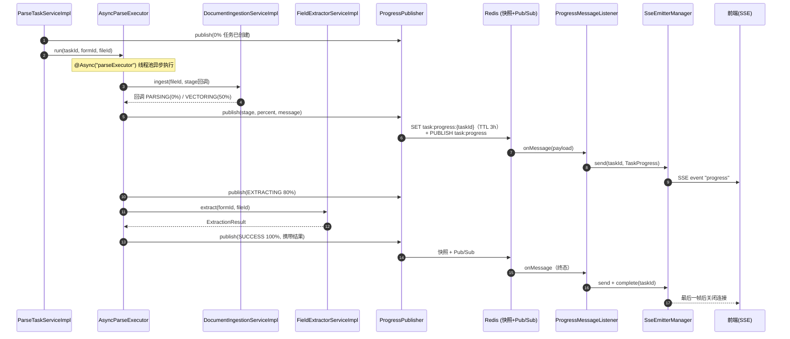

# Web 层 / Service 层 / 异步任务层

> **适用代码版本**：截至阶段 13 完成后（409 tests / 0 failures）。行号基于 2026-09-11 代码快照，后续变更可能漂移。
>
> **文档目录**：[ARCHITECTURE.md](./ARCHITECTURE.md)（总览）｜
> 本文档 ｜ [PDF_PARSE_PIPELINE.md](./PDF_PARSE_PIPELINE.md) ｜ [RAG_EXTRACT_PIPELINE.md](./RAG_EXTRACT_PIPELINE.md)

---

## 1. Controller 端点总表

应用统一 context-path `/aifp`（`server.servlet.context-path`），下表路径均为相对路径。

### 1.1 FileController（[FileController.java](../../java/com/aifp/aiagent/controller/FileController.java)，`/file`）

| 端点                  | 入参                            | 返回                                 | 下游调用                 | 说明                                 |
|---------------------|-------------------------------|------------------------------------|----------------------|------------------------------------|
| `POST /file/upload` | `MultipartFile file`          | `Result<FileUploadVO>`             | `FileService#upload` | 上传 PDF/Excel/Word，落库 `UPLOADED` 状态 |
| `GET /file/page`    | `PageQuery`（pageNum/pageSize） | `Result<PageResult<FileRecordVO>>` | `FileService#page`   | 分页查文件列表，按上传时间倒序                    |

### 1.2 FormController（[FormController.java](../../java/com/aifp/aiagent/controller/FormController.java)，`/form`）

| 端点                                  | 入参                            | 返回                           | 下游调用                      | 说明                      |
|-------------------------------------|-------------------------------|------------------------------|---------------------------|-------------------------|
| `POST /form/create`                 | `FormCreateDTO`（表单头 + 可选字段列表） | `Result<Long>`（formId）       | `FormService#createForm`  | 创建表单，字段批量插入且 code 表单内唯一 |
| `GET /form/{id}`                    | `Long id`                     | `Result<FormVO>`（含字段列表）      | `FormService#getFormById` | 表单详情                    |
| `GET /form/page`                    | `PageQuery`                   | `Result<PageResult<FormVO>>` | `FormService#page`        | 分页查表单，列表不含字段（避免 N+1）    |
| `POST /form/{id}/field`             | `FormFieldCreateDTO`          | `Result<Long>`（fieldId）      | `FormService#addField`    | 追加单字段                   |
| `DELETE /form/{id}/field/{fieldId}` | -                             | `Result<Void>`               | `FormService#deleteField` | 软删字段                    |
| `DELETE /form/{id}`                 | -                             | `Result<Void>`               | `FormService#deleteForm`  | 软删表单 + 级联软删字段           |

### 1.3 TaskController（[TaskController.java](../../java/com/aifp/aiagent/controller/TaskController.java)，`/task`）

| 端点                            | 入参                                 | 返回                              | 下游调用                                                           | 说明                                                                          |
|-------------------------------|------------------------------------|---------------------------------|----------------------------------------------------------------|-----------------------------------------------------------------------------|
| `POST /task`                  | `TaskStartRequest{formId, fileId}` | `Result<TaskStartVO>`（taskId）   | `ParseTaskService#start`                                       | 启动异步解析任务，立即返回 taskId                                                        |
| `GET /task/progress/{taskId}` | `String taskId`                    | `SseEmitter`（text/event-stream） | `SseEmitterManager#register` + `ProgressPublisher#getSnapshot` | SSE 订阅进度：连接建立即发快照首帧（断线重连可立即拿到最新状态），后续帧走 Redis Pub/Sub 推送；快照显示终态时立即 complete |

### 1.4 FillController（[FillController.java](../../java/com/aifp/aiagent/controller/FillController.java)，`/fill`）

| 端点                    | 入参                                          | 返回                         | 下游调用                            | 说明                              |
|-----------------------|---------------------------------------------|----------------------------|---------------------------------|---------------------------------|
| `POST /fill/{formId}` | `Long formId` + `@RequestParam Long fileId` | `Result<ExtractionResult>` | `FieldExtractorService#extract` | 同步触发 AI 抽取；返回类型化值、字段错误、LLM 调用次数 |

### 1.5 HealthController（[HealthController.java](../../java/com/aifp/aiagent/controller/HealthController.java)，`/health`）

| 端点                 | 返回                                  | 说明         |
|--------------------|-------------------------------------|------------|
| `GET /health/ping` | `Result<Map>`（app/status/timestamp） | 骨架自检，非业务功能 |

---

## 2. Service 层方法表

### 2.1 FileServiceImpl（[FileServiceImpl.java](../../java/com/aifp/aiagent/service/impl/FileServiceImpl.java)）

| 方法                                           | 逻辑要点                                                                                                               | 下游调用                                                        |
|----------------------------------------------|--------------------------------------------------------------------------------------------------------------------|-------------------------------------------------------------|
| `#upload(MultipartFile): FileUploadVO`       | ① 校验非空（2003）→ ② 按扩展名解析 FileType（2002，OTHER 拒收）→ ③ 落盘 → ④ insert `FileRecord(UPLOADED)` → ⑤ 转 VO                    | `LocalFileStorageService#store` → `FileRecordMapper#insert` |
| `#updateStatus(Long, FileStatus): void`      | **状态机唯一写入口**：① 记录不存在抛 2004 → ② 同态写（current == status）幂等跳过 → ③ `FileStatus#canTransitionTo` 白名单校验，非法抛 2006 → ④ 更新落库 | `FileRecordMapper#selectById` / `#updateById`               |
| `#getById(Long): FileRecordVO`               | 查单个文件记录，不存在抛 2004                                                                                                  | `FileRecordMapper#selectById`                               |
| `#page(PageQuery): PageResult<FileRecordVO>` | MyBatis-Plus 分页 + createTime 倒序，实体转 VO                                                                             | `FileRecordMapper#selectPage`                               |

### 2.2 FormServiceImpl（[FormServiceImpl.java](../../java/com/aifp/aiagent/service/impl/FormServiceImpl.java)）

| 方法                                               | 逻辑要点                                                           | 下游调用                                                 |
|--------------------------------------------------|----------------------------------------------------------------|------------------------------------------------------|
| `#createForm(FormCreateDTO): Long`               | ① insert 表单头 → ② 批量字段 code 唯一性校验（5002）→ ③ 按 order 逐条 insert 字段 | `FormDefinitionMapper` / `FormFieldDefinitionMapper` |
| `#getFormById(Long): FormVO`                     | 表单不存在抛 5001；查字段按 `sort` 升序组装                                   | 同上                                                   |
| `#addField(Long, FormFieldCreateDTO): Long`      | 追加单字段，code 与现有字段查重（5002）                                       | 同上                                                   |
| `#deleteField(Long, Long)` / `#deleteForm(Long)` | 逻辑删除；删表单级联软删其下字段                                               | 同上                                                   |
| `#page(PageQuery): PageResult<FormVO>`           | 分页查表单元数据（不含字段）                                                 | `FormDefinitionMapper#selectPage`                    |

### 2.3 ParseTaskServiceImpl（[ParseTaskServiceImpl.java](../../java/com/aifp/aiagent/service/impl/ParseTaskServiceImpl.java)）

| 方法                                              | 逻辑要点                                                                                                                | 下游调用                                                                                                       |
|-------------------------------------------------|---------------------------------------------------------------------------------------------------------------------|------------------------------------------------------------------------------------------------------------|
| `#start(Long formId, Long fileId): TaskStartVO` | ① 存在性校验（formId → 5001，fileId → 2004）→ ② 生成 UUID taskId → ③ 发布初始 0% 进度（"任务已创建"，避免异步线程启动空窗）→ ④ 触发异步执行 → ⑤ 立即返回 taskId | `FormService#getFormById` → `FileService#getById` → `ProgressPublisher#publish` → `AsyncParseExecutor#run` |

### 2.4 FieldExtractorServiceImpl（[FieldExtractorServiceImpl.java](../../java/com/aifp/aiagent/service/impl/FieldExtractorServiceImpl.java)）

抽取核心服务，被 `FillController`（同步直调）与 `AsyncParseExecutor`
（异步任务）两条路径复用。方法逻辑详见 [RAG_EXTRACT_PIPELINE.md](./RAG_EXTRACT_PIPELINE.md) 第 3 节。

| 方法                                                     | 职责一句话                                                                                                             |
|--------------------------------------------------------|-------------------------------------------------------------------------------------------------------------------|
| `#extract(Long formId, Long fileId): ExtractionResult` | 幂等 ingest → SUCCESS 预检 → `doExtract` → 失败 `markFailed` 后原样重抛                                                      |
| `#doExtract`（私有）                                       | EXTRACTING → 按字段检索合并去重 → Retry 循环 → SUCCESS（SUCCESS 终态文件跳过状态写）                                                    |
| `#retrieveAndMerge`（私有）                                | 每字段 `FieldQueryGenerator` 生成查询 → `VectorStoreService#search(query, topK, "fileId == '...'")` → 按 Document.id 保序去重 |
| `#extractWithRetry`（私有）                                | LLM 调用 → JSON 解析（剥 markdown 围栏，失败抛 3002）→ Schema 校验 → 字段错误反馈进下一轮 Prompt；共 `maxAttempts + 1` 次                     |
| `#markFailed`（私有）                                      | 非 SUCCESS 文件落 FAILED，二次异常吞掉避免覆盖原始异常                                                                               |

### 2.5 LocalFileStorageService（[LocalFileStorageService.java](../../java/com/aifp/aiagent/service/storage/LocalFileStorageService.java)）

| 方法                                        | 逻辑要点                                                                             |
|-------------------------------------------|----------------------------------------------------------------------------------|
| `#store(MultipartFile, FileType): String` | 存储路径规则 `{upload-dir}/yyyy/MM/{uuid}.{ext}`：年月子目录防单目录膨胀，UUID 文件名防冲突与中文路径问题；返回相对路径 |
| `#load(String): Resource`                 | 相对路径解析为 `FileSystemResource`                                                     |
| `#delete(String)`                         | `deleteIfExists`，失败仅告警                                                           |
| `#init()`（@PostConstruct）                 | 解析根目录绝对路径并创建                                                                     |

---

## 3. 异步任务与进度推送

### 3.1 全链路时序图

### 3.2 AsyncParseExecutor（[AsyncParseExecutor.java](../../java/com/aifp/aiagent/task/AsyncParseExecutor.java)）

| 方法                                              | 逻辑要点                                                                                                                                                                                                                                   |
|-------------------------------------------------|----------------------------------------------------------------------------------------------------------------------------------------------------------------------------------------------------------------------------------------|
| `#run(String taskId, Long formId, Long fileId)` | `@Async("parseExecutor")`；`TaskProgress base` 为基帧：① `ingestWithProgress`（入库回调驱动 0%/50%）→ ② publish 80% "AI抽取中" → ③ `FieldExtractorService#extract` → ④ publish 100% SUCCESS（携带 ExtractionResult）；任何异常 publish FAILED（percent=-1，消息含原因） |
| `#ingestWithProgress`（私有）                       | `ingest(fileId, stage -> publish)`，stage 为 PARSING → 0% / 其余 → 50%；extract 内部再幂等调 ingest 时因文件已向量化而跳过，无重复处理                                                                                                                             |

设计要点：

- 独立 bean 承载 `@Async`，供 `ParseTaskServiceImpl` 跨 bean 注入调用以激活 AOP 代理（同类内部调用 @Async 不生效）
- 失败仅发布 FAILED 进度；**文件状态由底层 ingest/extract 自行流转**，执行器不写状态

### 3.3 进度发布与消费

**ProgressPublisher**（[ProgressPublisher.java](../../java/com/aifp/aiagent/task/ProgressPublisher.java)）—— 双写 Redis：

| 方法                                   | 逻辑要点                                                                                                           |
|--------------------------------------|----------------------------------------------------------------------------------------------------------------|
| `#publish(TaskProgress)`             | ① 写快照键 `task:progress:{taskId}`（TTL 默认 3h）→ ② `convertAndSend("task:progress")` 发 Pub/Sub；写失败仅告警不抛，避免进度上报影响主流程 |
| `#getSnapshot(String): TaskProgress` | 读取最新快照，供 SSE 重连首帧；不存在/异常返回 null                                                                                |

**ProgressMessageListener
**（[ProgressMessageListener.java](../../java/com/aifp/aiagent/task/ProgressMessageListener.java)）：

- 实现 `MessageListener`，由 `RedisConfig` 注册到 `RedisMessageListenerContainer`
- `#onMessage`：复用 RedisTemplate 值序列化器对称反序列化 → 非 `TaskProgress` 直接忽略 → `SseEmitterManager#send` 路由 →
  终态（`isTerminal()`）追加 `#complete` 关闭连接；异常捕获告警不外泄

**SseEmitterManager**（[SseEmitterManager.java](../../java/com/aifp/aiagent/task/SseEmitterManager.java)）：

| 方法                                                   | 逻辑要点                                                                                         |
|------------------------------------------------------|----------------------------------------------------------------------------------------------|
| `#register(String taskId, long timeout): SseEmitter` | `ConcurrentHashMap` 按 taskId 持有 emitter；绑定 `onCompletion`/`onTimeout`/`onError` 回调自动移除，防内存泄漏 |
| `#send(String taskId, TaskProgress)`                 | 事件名 `progress`；无连接或 `IOException`/`IllegalStateException` 时移除 emitter 安全忽略                   |
| `#complete(String taskId)`                           | 主动 complete 并移除（终态时调用）                                                                       |
| `#isActive(String)`                                  | 诊断/测试用                                                                                       |

### 3.4 TaskProgress DTO 序列化约束

- `@JsonIgnore` 标注 `isTerminal()` 派生方法、`@JsonIgnoreProperties(ignoreUnknown = true)`——派生计算属性不参与 JSON
  序列化/反序列化，跨服务字段兼容
- 终态判定：`SUCCESS` / `FAILED`

### 3.5 异步线程池

`config/AsyncConfig.java` 定义 `parseExecutor`（ThreadPoolTaskExecutor），`@Async("parseExecutor")` 指定使用，隔离解析任务与
Web 请求线程。

---

## 4. 全局异常与错误码

`GlobalExceptionHandler` 转换规则与 `ResultCode` 分段详见 [ARCHITECTURE.md](./ARCHITECTURE.md) 第 7.1/7.2 节。业务侧高频错误码速查：

| 码           | 场景                                   |
|-------------|--------------------------------------|
| 2001        | 文件解析失败                               |
| 2002        | 不支持的文件类型（扩展名校验）                      |
| 2003        | 上传失败（文件为空 / 落盘失败）                    |
| 2004        | 文件不存在                                |
| 2006        | 非法文件状态流转（状态机白名单拒绝）                   |
| 3001 / 3002 | AI 调用失败 / AI 响应 JSON 解析失败            |
| 4001 / 4002 | 向量存储失败 / 检索失败（含"未检索到相关切片"）           |
| 5001–5004   | 表单不存在 / 字段 code 重复 / 字段不存在 / 表单未配置字段 |

---

## 5. 配置参数

| 配置键                                      | 环境变量                      | 默认          | 说明                                       |
|------------------------------------------|---------------------------|-------------|------------------------------------------|
| `task.sse.timeout-ms`                    | `TASK_SSE_TIMEOUT_MS`     | 1800000     | SSE 连接超时（30 分钟，覆盖大文件解析全程）                |
| `task.progress.snapshot-ttl-hours`       | `TASK_PROGRESS_TTL_HOURS` | 3           | 进度快照 Redis 存活时长（小时）                      |
| `file.upload-dir`                        | `FILE_UPLOAD_DIR`         | `./uploads` | 上传文件根目录（生产建议绝对路径）                        |
| `server.servlet.context-path`            | -                         | `/aifp`     | 统一前缀                                     |
| `spring.servlet.multipart.max-file-size` | -                         | 100MB       | 上传大小限制（Tomcat max-swallow-size 同步 100MB） |
